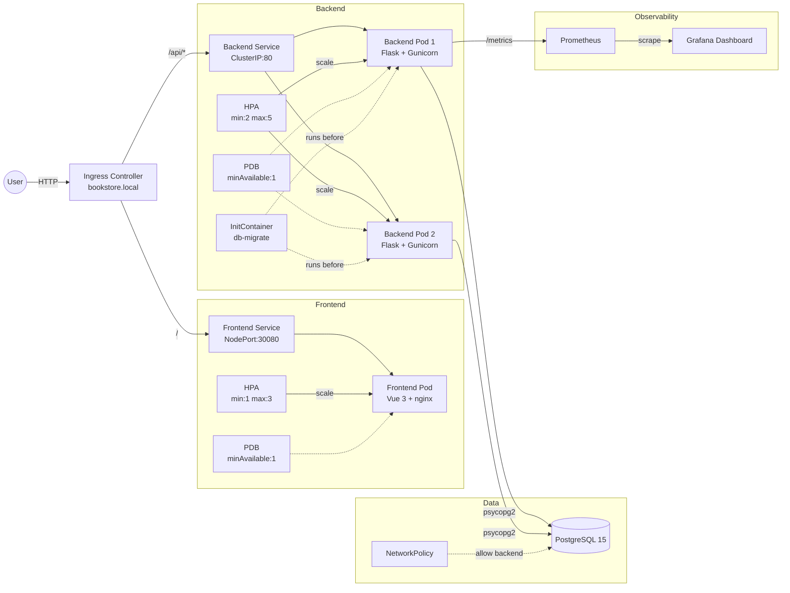

# ☁️ Cloud-Native Online Bookstore System (Kubernetes)

> DSAA4040 Engineering Track Project | Group 5

A production-ready, cloud-native online bookstore system built with **Flask**, **Vue 3**, **PostgreSQL**, **nginx**, and **Kubernetes**. Designed to run on Minikube with full observability, automated testing, JWT authentication, rate limiting, database migration support, and horizontal pod autoscaling.

## 🏗️ System Architecture



## 🛠️ Tech Stack

| Layer | Technology |
|-------|------------|
| **Frontend** | Vue 3.4 + Vite 5.2 + Vue Router 4.3 + Tailwind CSS 3.4, nginx 1.25-alpine |
| **Backend** | Python 3.11, Flask 3.0 + Gunicorn 22, psycopg2 connection pool |
| **Authentication** | JWT (PyJWT), Werkzeug password hashing, Flask-Limiter rate limiting |
| **Database** | PostgreSQL 15 (Alpine), Alembic migrations |
| **Orchestration** | Kubernetes 1.28+, Kustomize overlays |
| **Observability** | Prometheus (kube-prometheus-stack), Grafana dashboards |
| **CI/CD** | GitHub Actions (lint, test, build, security scan) |
| **Security** | Trivy vulnerability scanner, non-root containers, NetworkPolicy, security headers, IDOR fix |
| **Transactions** | Explicit `BEGIN/COMMIT/ROLLBACK` for order creation (ACID guarantee) |
| **Cache** | **Redis** distributed cache with memory fallback; write-through invalidation on order creation |
| **Observability** | Prometheus, Grafana, **Alertmanager**, structured JSON logging, **X-Request-ID** distributed tracing |
| **API Design** | Pydantic v2 validation with user-friendly error messages (no internal jargon leaked) |
| **DB Monitoring** | Real-time connection pool metrics (used/free/utilization) exposed on `/metrics` |

## 🚀 Quick Start

### Prerequisites

- [Docker](https://docs.docker.com/get-docker/)
- [Minikube](https://minikube.sigs.k8s.io/docs/start/) (Docker driver)
- [kubectl](https://kubernetes.io/docs/tasks/tools/)

### 1. Start Minikube

```bash
minikube start --driver=docker --cpus=2 --memory=4096
minikube addons enable ingress metrics-server
```

### 2. One-Line Deploy

```bash
make deploy-tag VERSION=v3.0.3
```

This builds images, loads them into Minikube, updates Kustomize tags, and deploys everything including database migrations.

### 3. Access the Application

```bash
# Add to /etc/hosts (requires sudo)
echo "$(minikube ip) bookstore.local" | sudo tee -a /etc/hosts

# Open in browser
open http://bookstore.local

# Or use NodePort
minikube service bookstore-frontend --url -n bookstore
```

### 4. Verify Deployment

```bash
make status   # View all pods, services, HPA
make test     # Wait for rollout and print frontend URL
```

## 📁 Directory Structure

```
.
├── src/
│   ├── backend/
│   │   ├── app.py               # Flask application factory (create_app)
│   │   ├── main.py              # Compatibility entrypoint for gunicorn
│   │   ├── schemas.py           # Pydantic v2 request/response validation
│   │   ├── requirements.txt     # Python deps (Flask, Gunicorn, PyJWT, Flask-Limiter, Pydantic, Redis)
│   │   ├── Dockerfile
│   │   ├── .dockerignore        # Excludes __pycache__/tests/ from build context
│   │   ├── alembic.ini          # Alembic configuration
│   │   ├── alembic/
│   │   │   ├── env.py
│   │   │   └── versions/
│   │   │       ├── 001_initial_schema.py
│   │   │       ├── 002_enhanced_schema.py    # stock, status_history, triggers
│   │   │       ├── 003_users_table.py        # JWT auth, user_id FKs
│   │   │       └── 004_performance_indexes.py # DB indexes
│   │   ├── routes/              # Flask Blueprints
│   │   │   ├── __init__.py
│   │   │   ├── probes.py        # /startup, /healthz, /ready, /metrics
│   │   │   ├── books.py         # /api/books, /api/books/search
│   │   │   ├── cart.py          # /api/cart
│   │   │   ├── orders.py        # /api/orders
│   │   │   ├── auth.py          # /api/auth/*
│   │   │   ├── payments.py      # /api/payments
│   │   │   └── admin.py         # /api/admin/*
│   │   ├── utils/               # Shared utilities
│   │   │   ├── __init__.py
│   │   │   ├── db.py            # psycopg2 connection pool + db_transaction context manager
│   │   │   ├── auth.py          # JWT helpers + @jwt_required
│   │   │   ├── cache.py         # Redis distributed cache with memory fallback
│   │   │   ├── metrics.py       # Prometheus counters
│   │   │   ├── response.py      # json_response + DecimalEncoder
│   │   │   └── fallback.py      # In-memory fallback data
│   │   └── tests/               # pytest suite (82 cases, 90% cov)
│   │       ├── conftest.py
│   │       ├── e2e/             # Playwright end-to-end tests
│   │       │   └── test_shopping_flow.py
│   │       ├── integration/     # testcontainers real-DB tests
│   │       │   └── test_orders_integration.py
│   │       ├── test_books.py
│   │       ├── test_cart.py
│   │       ├── test_orders.py
│   │       ├── test_auth.py
│   │       ├── test_payments.py
│   │       ├── test_admin.py
│   │       ├── test_probes.py
│   │       ├── test_encoder.py
│   │       └── test_errors.py
│   └── frontend/
│       ├── package.json         # Vue 3 + Vite + Tailwind + Vue Router + Axios
│       ├── package-lock.json    # Lockfile for reproducible builds
│       ├── vite.config.js
│       ├── vitest.config.js     # Vitest unit test configuration
│       ├── playwright.config.js # Playwright E2E configuration
│       ├── tailwind.config.js
│       ├── index.html           # Vite entry
│       ├── nginx.conf           # /api/ proxy + SPA routing + probes
│       ├── Dockerfile           # Multi-stage: node build -> nginx serve
│       ├── .dockerignore        # Excludes node_modules/tests from build context
│       └── src/
│           ├── main.js          # Vue app bootstrap
│           ├── App.vue          # Root layout
│           ├── router/index.js  # Vue Router with auth guards
│           ├── api/client.js    # Axios + JWT interceptor
│           ├── store.js         # Reactive cart count
│           └── components/
│               ├── Navbar.vue       # Navigation + auth state
│               ├── BookList.vue     # Browse + search books
│               ├── BookCard.vue     # Book card component
│               ├── CartView.vue     # Shopping cart
│               ├── OrdersView.vue   # Order history
│               ├── LoginView.vue    # Sign in
│               ├── RegisterView.vue # Sign up
│               ├── ProfileView.vue  # User profile + orders
│               ├── AdminView.vue    # Admin metrics dashboard
│               ├── Toast.vue        # Notifications
│               ├── __tests__/       # Vue component + API tests
│               │   ├── BookCard.spec.js
│               │   ├── CartView.spec.js
│               │   ├── LoginView.spec.js
│               │   ├── Navbar.spec.js
│               │   └── client.integration.spec.js
│               └── e2e/             # Playwright browser E2E tests
│                   └── shopping-flow.spec.js
├── k8s/
│   ├── base/                    # Base manifests
│   │   ├── deployment-backend.yaml
│   │   ├── deployment-frontend.yaml
│   │   ├── deployment-postgres.yaml
│   │   ├── hpa.yaml             # HorizontalPodAutoscaler
│   │   ├── pdb.yaml             # PodDisruptionBudget
│   │   ├── servicemonitor.yaml  # Prometheus scrape config
│   │   ├── grafana-dashboard.yaml
│   │   ├── networkpolicy-*.yaml # Zero-trust network policies
│   │   └── ...
│   └── overlays/
│       └── minikube/            # Minikube-specific patches
│           ├── kustomization.yaml
│           ├── patch-resources.yaml
│           └── patch-service-type.yaml
├── scripts/
│   ├── loadtest.js              # Full shopping flow (k6)
│   ├── loadtest-hpa.js          # HPA trigger test (k6)
│   └── loadtest-v3.js           # Phase 3: pagination + auth + payment (k6)
├── .github/workflows/ci.yml     # GitHub Actions pipeline
├── Makefile                     # Build / load / deploy commands
└── README.md                    # This file
```

## 📡 API Reference

> All API responses include `X-Request-ID` header for distributed tracing.

### Validation Errors

All write endpoints use **Pydantic v2** for request validation. Invalid payloads return `400` with a **user-friendly** error object (no internal field names or Python types leaked):

```json
{
  "error": {
    "field": "quantity",
    "message": "must be >= 1"
  }
}
```

We use `except ValidationError as e` (not broad `except Exception`) to avoid accidentally catching programming errors and exposing them to clients.

### Authentication

| Method | Endpoint | Body | Description |
|--------|----------|------|-------------|
| `POST` | `/api/auth/register` | `{username, email, password}` | Create account (rate limit: 5/min) |
| `POST` | `/api/auth/login` | `{username, password}` | Get JWT token (rate limit: 10/min) |
| `GET` | `/api/auth/me` | `Authorization: Bearer <token>` | Get current user |

### Books

| Method | Endpoint | Description |
|--------|----------|-------------|
| `GET` | `/api/books?page=1&per_page=20` | List books with pagination (max 100) |
| `GET` | `/api/books/<id>` | Get book by ID |
| `GET` | `/api/books/search?q=<keyword>` | Search books by title or author |

### Cart

| Method | Endpoint | Body / Query | Description |
|--------|----------|--------------|-------------|
| `POST` | `/api/cart` | `{session_id, book_id, quantity}` | Add item to cart |
| `GET` | `/api/cart` | `?session_id=xxx` | View cart |
| `PUT` | `/api/cart/item/<id>` | `{session_id, quantity}` | Update quantity (0 = delete). Ownership verified via JOIN to prevent IDOR |
| `DELETE` | `/api/cart/item/<id>` | `?session_id=xxx` | Remove item. Ownership verified via JOIN to prevent IDOR |

### Orders

| Method | Endpoint | Body / Query | Description |
|--------|----------|--------------|-------------|
| `POST` | `/api/orders` | `{session_id}` | Place order from cart (ACID transaction: orders → order_items → books stock → cart cleanup) |
| `GET` | `/api/orders` | `?session_id=xxx&page=1&per_page=20` | List orders with pagination |
| `GET` | `/api/orders/<id>` | — | Order details |

### Payments

| Method | Endpoint | Body | Description |
|--------|----------|------|-------------|
| `POST` | `/api/payments` | `{order_id}` | Mock payment (confirmed -> shipped) |

### Admin

| Method | Endpoint | Headers | Body | Description |
|--------|----------|---------|------|-------------|
| `PUT` | `/api/admin/orders/<id>/status` | `Authorization: Bearer <admin_token>` | `{status}` | Update order status (admin only) |

### Health & Metrics

| Method | Endpoint | Description |
|--------|----------|-------------|
| `GET` | `/startup` | Startup probe (DB pool initialized) |
| `GET` | `/healthz` | Liveness probe (DB connectivity) |
| `GET` | `/ready` | Readiness probe (fallback-aware) |
| `GET` | `/metrics` | Prometheus metrics (QPS, latency, DB, business) |

### Example: Full Shopping Flow

```bash
SESSION=$(uuidgen)
TOKEN=$(curl -s -X POST http://bookstore.local/api/auth/login \
  -H "Content-Type: application/json" \
  -d '{"username":"alice","password":"secret123"}' | jq -r '.data.token')

# Browse books (paginated)
curl "http://bookstore.local/api/books?page=1&per_page=5"

# Search books
curl "http://bookstore.local/api/books/search?q=Kubernetes"

# Add to cart
curl -X POST http://bookstore.local/api/cart \
  -H "Content-Type: application/json" \
  -d "{\"session_id\":\"$SESSION\",\"book_id\":\"2\",\"quantity\":1}"

# View cart
curl "http://bookstore.local/api/cart?session_id=$SESSION"

# Place order
curl -X POST http://bookstore.local/api/orders \
  -H "Content-Type: application/json" \
  -d "{\"session_id\":\"$SESSION\"}"

# Mock payment
curl -X POST http://bookstore.local/api/payments \
  -H "Content-Type: application/json" \
  -H "Authorization: Bearer $TOKEN" \
  -d '{"order_id":1}'

# View orders (paginated)
curl "http://bookstore.local/api/orders?session_id=$SESSION&page=1&per_page=10"

# Admin: update order status (requires admin JWT)
curl -X PUT http://bookstore.local/api/admin/orders/1/status \
  -H "Content-Type: application/json" \
  -H "Authorization: Bearer $ADMIN_TOKEN" \
  -d '{"status":"delivered"}'
```

## ☸️ Kubernetes Features

### Horizontal Pod Autoscaler (HPA)

```yaml
# Backend: min 2, max 5 replicas (target CPU 70%, memory 80%)
# Frontend: min 1, max 3 replicas (target CPU 70%)
```

Requires `minikube addons enable metrics-server`.

### PodDisruptionBudget (PDB)

Ensures at least 1 backend and 1 frontend pod remain available during node drains or upgrades.

### Topology Spread Constraints

Prevents all backend replicas from scheduling on the same node, ensuring availability during node failures:

```yaml
topologySpreadConstraints:
  - maxSkew: 1
    topologyKey: kubernetes.io/hostname
    whenUnsatisfiable: ScheduleAnyway
    labelSelector:
      matchLabels:
        app: bookstore-backend
```

### NetworkPolicy

Zero-trust network mesh:
- `frontend-netpol`: Ingress → frontend only
- `backend-netpol`: frontend → backend + Redis only
- `postgres-allow-backend-only`: backend → DB only
- `redis-netpol`: backend → Redis only

### InitContainer: Database Migrations

The backend deployment includes an `initContainer` that runs `alembic upgrade head` before the main container starts. This ensures schema is always up-to-date before serving traffic.

```yaml
initContainers:
  - name: db-migrate
    command: ["alembic", "upgrade", "head"]
```

### Three-Tier Health Probes

| Probe | Endpoint | Purpose | Failure Threshold |
|-------|----------|---------|-------------------|
| **Startup** | `/startup` | Prevents premature liveness failures during Alembic init | 12 × 5s = 60s |
| **Liveness** | `/healthz` | Detects deadlock/hang; restarts pod | 3 × 10s |
| **Readiness** | `/ready` | Controls traffic routing; handles DB fallback gracefully | 3 × 5s |

### Graceful Shutdown

- **Flask**: Catches `SIGTERM`/`SIGINT`, closes DB connection pool, then exits
- **Gunicorn**: Runs with `--graceful-timeout 30 --timeout 120` to drain in-flight requests

## 📊 Monitoring & Observability

### Request Tracing (X-Request-ID)

Every API request is assigned a unique `X-Request-ID`:
- Generated in `before_request` if not provided by client
- Logged with every request/response
- Returned in response headers for end-to-end correlation
- Enables tracing a single user action across nginx → Flask → PostgreSQL

```bash
curl -I http://bookstore.local/api/books
# X-Request-ID: a1b2c3d4
```

### Access Prometheus

```bash
make port-forward-prometheus
# Open http://localhost:9090
```

### Access Grafana

```bash
make port-forward-grafana
# Open http://localhost:3000
# Default credentials: admin / $(kubectl get secret -n monitoring prometheus-grafana -o jsonpath='{.data.admin-password}' | base64 -d)
```

### Dashboards

- **Cloud-Native Bookstore** (auto-provisioned, 6 panels)
  - HTTP Request Rate & Duration
  - DB Connection Success/Failed
  - **DB Connection Pool** (used / free / utilization %)
  - Orders Created & Cart Items Added

### Alertmanager Rules

PrometheusRule CRD defines 5 critical alerts:

| Alert | Condition | Severity |
|-------|-----------|----------|
| `BookstoreHighLatency` | P95 > 2s for 2m | warning |
| `BookstoreHighErrorRate` | 5xx rate > 1% for 1m | critical |
| `BookstoreDBConnectionFailures` | > 5 failed connections in 5m | warning |
| `BookstoreHighMemoryUsage` | Memory > 80% for 2m | warning |
| `BookstoreDBPoolExhausted` | Pool utilization > 90% for 1m | critical |

### Prometheus Metrics

| Metric | Type | Description |
|--------|------|-------------|
| `http_requests_total` | Counter | Total requests by method, path, status |
| `http_request_duration_seconds` | Counter | Cumulative request duration |
| `db_connections_success_total` | Counter | Successful DB connections |
| `db_connections_failed_total` | Counter | Failed DB connections |
| `db_pool_used_connections` | Gauge | Currently active DB pool connections |
| `db_pool_free_connections` | Gauge | Available DB pool connections |
| `orders_created_total` | Counter | Orders placed |
| `cart_items_added_total` | Counter | Items added to cart |

## 🔐 Security Features

### IDOR Vulnerability Fix

The cart `PUT/DELETE` endpoints previously allowed any user to modify any cart item by guessing the `item_id`. This was fixed by adding a `JOIN` with the `carts` table to verify the `session_id` matches the item's owner:

```sql
SELECT ci.id FROM cart_items ci
JOIN carts c ON ci.cart_id = c.id
WHERE ci.id = %s AND c.session_id = %s
```

Unauthorized attempts now return `404 "item not found or access denied"`.

### JWT Authentication

- PyJWT with HS256 signing, 24h expiry
- Passwords hashed with Werkzeug
- Token injected via `Authorization: Bearer` header
- Axios interceptors handle 401 globally (redirect to login)

### Rate Limiting

| Endpoint | Limit |
|----------|-------|
| `/api/auth/register` | 5 per minute |
| `/api/auth/login` | 10 per minute |
| Default | 200 per minute |

> Note: Memory backend is single-Pod. For multi-replica consistency, use Redis in production.

### Security Headers

All API responses include:
- `X-Content-Type-Options: nosniff`
- `X-Frame-Options: DENY`
- `X-XSS-Protection: 1; mode=block`
- `Strict-Transport-Security: max-age=31536000; includeSubDomains`
- `Referrer-Policy: strict-origin-when-cross-origin`

### Container Security

- All containers run as **non-root** (`runAsUser: 1000/101/70`)
- **Capabilities dropped**: `["ALL"]`
- `allowPrivilegeEscalation: false`
- Base images patched during build (`apt-get upgrade` / `apk upgrade`)

## 🧪 Testing

### Backend Tests

```bash
make test-backend              # Unit tests only (mock DB)
make test-backend-integration  # Integration + E2E tests (requires Docker)
make test-frontend             # Frontend Vitest unit tests
make test-frontend-e2e         # Frontend Playwright browser E2E tests
```

### Test Coverage

| Test File | Cases | Description |
|-----------|-------|-------------|
| `test_books.py` | 8 | List, pagination, search, 404 |
| `test_cart.py` | 10 | Add, update, delete, empty cart, validation |
| `test_orders.py` | 7 | Create, list, pagination, empty cart |
| `test_auth.py` | 9 | Register, login, JWT, 401/403 |
| `test_payments.py` | 3 | Validation, state transition, 503 |
| `test_admin.py` | 4 | Auth, forbidden, invalid status |
| `test_probes.py` | 4 | startup/healthz/ready/metrics |
| `test_encoder.py` | 2 | DecimalEncoder, json_response |
| `test_errors.py` | 3 | 404, CORS, security headers |
| `test_orders_integration.py` | 6 | **Real PostgreSQL** via testcontainers: stock deduction, insufficient stock, payment transition, status_history, cart cleanup, pagination |
| `test_shopping_flow.py` | 1 | **Playwright E2E**: register → login → browse → cart → order → pay |
| **Backend Total** | **82** | **90% coverage** |

### Frontend Tests

| Test File | Cases | Description |
|-----------|-------|-------------|
| `BookCard.spec.js` | 5 | Component render, ISBN, price format, add event |
| `LoginView.spec.js` | 5 | Form render, validation, success, failure, loading state |
| `CartView.spec.js` | 4 | Empty state, items render, remove, place order |
| `Navbar.spec.js` | 4 | Auth state, logout, nav links |
| `client.integration.spec.js` | 7 | MSW-based API: session injection, JWT, 401 interceptor, errors |
| `shopping-flow.spec.js` | 3 | **Playwright E2E**: browse → login → cart → order (browser automation) |
| **Frontend Total** | **33** | |

| **Project Total** | **115** | |

### Load Testing (k6)

```bash
make load-test          # Full shopping flow
# Or manually:
MINIKUBE_IP=$(minikube ip)
docker run --rm -i --network=host \
  -v "$(pwd)/scripts:/scripts" grafana/k6:latest \
  run /scripts/loadtest-v3.js -e BASE_URL=http://${MINIKUBE_IP}:30080
```

**Latest Results** (50 VUs, 40s):
- p(95) latency: **1.76ms**
- Error rate: < 10%

## ⚡ Performance & Caching

### In-Memory Cache

Book list pages (`/api/books`) are cached for 60 seconds using a TTL in-memory cache:
- Cache key: `books_list:{page}:{per_page}`
- Falls back to DB query on cache miss

### Write-Through Cache Invalidation

When an order is placed, the `books_list:*` cache prefix is **immediately cleared** so stock changes are visible in the next listing request:

```python
# In orders.py POST
from utils.cache import cache_clear_prefix
cache_clear_prefix("books_list:")
```

This eliminates the stale-read problem where a user might see outdated stock quantities after a purchase.

### Pydantic Error Beautification

Invalid API payloads return user-friendly error messages instead of raw Pydantic internals:

| Before (raw Pydantic) | After (beautified) |
|----------------------|-------------------|
| `Input should be greater than or equal to 1` | `must be >= 1` |
| `Input should be a valid string` | `must be a valid string` |

Implementation: `schemas.py` → `format_validation_errors()`

## 🔄 Database Migrations (Alembic)

### Migration History

| Version | Description |
|---------|-------------|
| `001` | Initial schema: books, carts, cart_items, orders, order_items |
| `002` | Enhanced: `updated_at` triggers, `stock_quantity`, `status_history` JSONB, status CHECK constraint |
| `003` | Users table: `username`, `email`, `password_hash`, `is_admin`; FKs to carts & orders |
| `004` | Performance indexes: `idx_books_title_author`, `idx_books_isbn`, `idx_orders_session_created`, `idx_cart_items_cart_book`, `idx_order_items_order` |

### Create a New Migration

```bash
cd src/backend
alembic revision -m "add reviews table"
# Edit alembic/versions/xxx_add_reviews_table.py
```

### Run Migrations Manually

```bash
cd src/backend
alembic upgrade head
```

### In Kubernetes

Migrations run automatically via the `db-migrate` initContainer on every pod start. If the schema is already at the latest version, Alembic exits cleanly.

## 🔧 Makefile Commands

| Command | Description |
|---------|-------------|
| `make help` | Show all available commands |
| `make build` | Build both backend & frontend images (`VERSION=dev`) |
| `make build-backend` | Build backend only |
| `make build-frontend` | Build frontend only |
| `make load` | Build, load into Minikube, update kustomization tags |
| `make deploy` | Apply Kustomize overlay |
| `make deploy-tag` | One-shot: build → load → update tag → deploy + monitoring |
| `make test` | Check pod status & wait for rollout |
| `make test-backend` | Run backend unit tests (mock DB) |
| `make test-backend-integration` | Run backend integration + E2E tests |
| `make test-frontend` | Run frontend Vitest unit tests |
| `make test-frontend-e2e` | Run frontend Playwright browser E2E tests |
| `make status` | Show pods, services, HPA, ingress |
| `make clean` | Delete all resources |
| `make scan` | Trivy security scan |
| `make load-test` | Run k6 load test |
| `make port-forward-prometheus` | Access Prometheus UI |
| `make port-forward-grafana` | Access Grafana UI |

Override version: `make deploy-tag VERSION=v3.0.3`

## 🐛 Troubleshooting

### `make clean` fails with "NotFound" errors

**Symptom:**
```
Error from server (NotFound): configmaps "bookstore-grafana-dashboard" not found
make: *** [Makefile:117: clean] Error 1
```

**Fix:** Already fixed in latest Makefile. `kubectl delete` now uses `--ignore-not-found=true` so partial or inconsistent cluster states don't block cleanup.

### Backend pod stuck in `CrashLoopBackOff`

**Symptom:** `kubectl get pods` shows backend restarting repeatedly.

**Diagnose:**
```bash
kubectl logs -n bookstore deployment/bookstore-backend --previous | tail -30
```

**Common causes:**
- **Logging config error** (`python-json-logger` KeyError) — Fixed in `app.py`. Remove `rename_fields` from `JsonFormatter` if you encounter this.
- **Database connection failure** — Check postgres pod is running and Secret `db-credentials` exists.
- **Missing environment variables** — Backend falls back to in-memory mode automatically, but verify `DB_HOST`, `POSTGRES_DB`, etc.

### Redis pod `ImagePullBackOff`

**Symptom:**
```
Failed to pull image "redis:7-alpine": context deadline exceeded
```

**Fix:** Minikube's internal Docker daemon cannot always reach Docker Hub. Pre-pull and load the image manually:

```bash
docker pull redis:7-alpine
minikube image load redis:7-alpine
kubectl rollout restart deployment/redis -n bookstore
```

### `kustomize build` security error for monitoring

**Symptom:**
```
accumulation err='accumulating resources from '../base/grafana-dashboard.yaml': security; file is not in or below ...'
```

**Fix:** Kustomize v3+ disallows path traversal outside the build directory. Copy referenced files locally:

```bash
cp k8s/base/grafana-dashboard.yaml k8s/monitoring/
cp k8s/base/servicemonitor.yaml k8s/monitoring/
```

Then update `k8s/monitoring/kustomization.yaml` to reference local copies.

### Cannot access app from Windows browser

**Symptom:** `http://127.0.0.1:XXXXX` works in WSL2 but not in Windows.

**Why:** `127.0.0.1` in WSL2 is isolated from Windows host.

**Solutions:**

| Method | URL | Steps |
|--------|-----|-------|
| **NodePort (Recommended)** | `http://$(minikube ip):30080` | Get Minikube IP: `minikube ip` |
| **minikube service** | Auto-detected | `minikube service bookstore-frontend -n bookstore` |
| **Ingress + hosts** | `http://bookstore.local` | Add `$(minikube ip) bookstore.local` to Windows `C:\Windows\System32\drivers\etc\hosts` |
| **kubectl port-forward** | `http://localhost:8080` | `kubectl port-forward -n bookstore svc/bookstore-frontend 8080:80` |

### Deployment timeout waiting for rollout

**Symptom:** `make deploy-tag` hangs on `kubectl wait`.

**Fix:** Check pod status first:

```bash
kubectl get pods -n bookstore
kubectl describe pod -n bookstore <pod-name>
```

If backend is stuck in `Init:0/1`, the `db-migrate` initContainer is waiting for PostgreSQL. Ensure postgres pod is `Running`.

## 🔄 CI/CD Pipeline

GitHub Actions workflow (`.github/workflows/ci.yml`):

1. **Lint** — Hadolint (Dockerfile), kubeconform (K8s manifests)
2. **Test Backend (Unit)** — pytest with `-m "not integration and not e2e"` and coverage report (required)
3. **Test Backend (Integration)** — testcontainers + Playwright API tests (optional, `continue-on-error`)
4. **Test Frontend (Unit)** — Vitest component + API integration tests, then `vite build`
5. **Test Frontend (E2E)** — Playwright browser automation tests (Chromium, optional)
6. **Build** — Docker Buildx with GHA cache
7. **Security Scan** — Trivy SARIF → GitHub Security tab
8. **Deploy Check** — Kustomize build validation

## 📝 License

MIT License — DSAA4040 Course Project.

## 🙏 Acknowledgements

- [Vue.js](https://vuejs.org/)
- [Flask](https://flask.palletsprojects.com/)
- [Kubernetes](https://kubernetes.io/)
- [Prometheus](https://prometheus.io/)
- [Grafana](https://grafana.com/)
- [Alembic](https://alembic.sqlalchemy.org/)
- [Minikube](https://minikube.sigs.k8s.io/)
