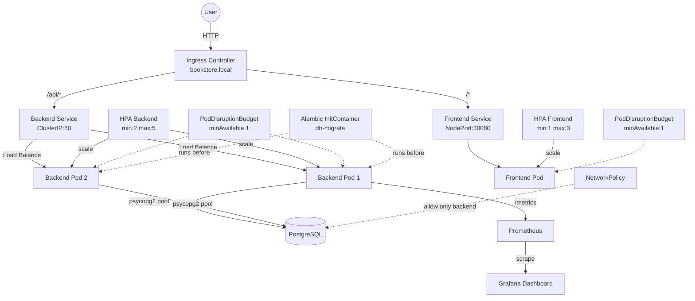

# ☁️ Cloud-Native Online Bookstore System (Kubernetes)

> DSAA4040 Engineering Track Project | Group 5

A production-ready, cloud-native online bookstore system built with Python, PostgreSQL, nginx, and Kubernetes. Designed to run on Minikube with full observability, automated testing, and database migration support.

## 🏗️ System Architecture



## 🛠️ Tech Stack

| Layer | Technology |
|-------|------------|
| **Frontend** | Static HTML + Vanilla JS (SPA), nginx 1.25-alpine |
| **Backend** | Python 3.11, `http.server` + threading, psycopg2 connection pool |
| **Database** | PostgreSQL 15 (Alpine), Alembic migrations |
| **Orchestration** | Kubernetes 1.28+, Kustomize overlays |
| **Observability** | Prometheus (kube-prometheus-stack), Grafana dashboards |
| **CI/CD** | GitHub Actions (lint, test, build, security scan) |
| **Security** | Trivy vulnerability scanner, non-root containers, NetworkPolicy |

## 🚀 Quick Start

### Prerequisites

- [Docker](https://docs.docker.com/get-docker/)
- [Minikube](https://minikube.sigs.k8s.io/docs/start/) (Docker driver)
- [kubectl](https://kubernetes.io/docs/tasks/tools/)

### 1. Start Minikube

```bash
minikube start --driver=docker --cpus=2 --memory=4096
minikube addons enable ingress metrics-server
```

### 2. One-Line Deploy

```bash
make deploy-tag VERSION=v1.4.2
```

This builds images, loads them into Minikube, updates Kustomize tags, and deploys everything.

### 3. Access the Application

```bash
# Add to /etc/hosts (requires sudo)
echo "$(minikube ip) bookstore.local" | sudo tee -a /etc/hosts

# Open in browser
open http://bookstore.local

# Or use NodePort
minikube service bookstore-frontend --url -n bookstore
```

### 4. Verify Deployment

```bash
make status   # View all pods, services, HPA
make test     # Wait for rollout and print frontend URL
```

## 📁 Directory Structure

```
.
├── src/
│   ├── backend/
│   │   ├── main.py              # HTTP server + REST API
│   │   ├── requirements.txt     # Python deps (psycopg2, alembic, pytest)
│   │   ├── Dockerfile
│   │   ├── alembic.ini          # Alembic configuration
│   │   ├── alembic/             # Migration scripts
│   │   │   ├── env.py
│   │   │   └── versions/
│   │   │       └── 001_initial_schema.py
│   │   └── tests/               # pytest suite
│   │       ├── conftest.py
│   │       ├── test_api.py
│   │       ├── test_probes.py
│   │       ├── test_metrics.py
│   │       └── test_encoder.py
│   └── frontend/
│       ├── index.html           # SPA (books, cart, orders)
│       ├── nginx.conf           # /api/ proxy + /healthz
│       └── Dockerfile
├── k8s/
│   ├── base/                    # Base manifests
│   │   ├── deployment-backend.yaml
│   │   ├── deployment-frontend.yaml
│   │   ├── deployment-postgres.yaml
│   │   ├── hpa.yaml             # HorizontalPodAutoscaler
│   │   ├── pdb.yaml             # PodDisruptionBudget
│   │   ├── servicemonitor.yaml  # Prometheus scrape config
│   │   ├── grafana-dashboard.yaml
│   │   ├── networkpolicy-db.yaml
│   │   └── ...
│   └── overlays/
│       └── minikube/            # Minikube-specific patches
│           ├── kustomization.yaml
│           ├── patch-resources.yaml
│           └── patch-service-type.yaml
├── .github/workflows/ci.yml     # GitHub Actions pipeline
├── Makefile                     # Build / load / deploy commands
├── scripts/demo-final.sh        # End-to-end demo script
└── README.md                    # This file
```

## 📡 API Reference

### Books

| Method | Endpoint | Description |
|--------|----------|-------------|
| `GET` | `/api/books` | List all books |
| `GET` | `/api/books/<id>` | Get book by ID |
| `GET` | `/api/books/search?q=<keyword>` | Search books by title |

### Cart

| Method | Endpoint | Body / Query | Description |
|--------|----------|--------------|-------------|
| `POST` | `/api/cart` | `{session_id, book_id, quantity}` | Add item to cart |
| `GET` | `/api/cart` | `?session_id=xxx` | View cart |
| `PUT` | `/api/cart/item/<id>` | `{session_id, quantity}` | Update quantity (0 = delete) |
| `DELETE` | `/api/cart/item/<id>` | `?session_id=xxx` | Remove item |

### Orders

| Method | Endpoint | Body / Query | Description |
|--------|----------|--------------|-------------|
| `POST` | `/api/orders` | `{session_id}` | Place order from cart |
| `GET` | `/api/orders` | `?session_id=xxx` | List orders |
| `GET` | `/api/orders/<id>` | — | Order details |

### Health & Metrics

| Method | Endpoint | Description |
|--------|----------|-------------|
| `GET` | `/healthz` | Liveness probe (DB connectivity) |
| `GET` | `/ready` | Readiness probe (fallback-aware) |
| `GET` | `/metrics` | Prometheus metrics (QPS, latency, DB connections) |

### Example: Full Shopping Flow

```bash
SESSION=$(uuidgen)

# Search books
curl "http://bookstore.local/api/books/search?q=Kubernetes"

# Add to cart
curl -X POST http://bookstore.local/api/cart \
  -H "Content-Type: application/json" \
  -d "{\"session_id\":\"$SESSION\",\"book_id\":\"2\",\"quantity\":1}"

# View cart
curl "http://bookstore.local/api/cart?session_id=$SESSION"

# Place order
curl -X POST http://bookstore.local/api/orders \
  -H "Content-Type: application/json" \
  -d "{\"session_id\":\"$SESSION\"}"

# View orders
curl "http://bookstore.local/api/orders?session_id=$SESSION"
```

## ☸️ Kubernetes Features

### Horizontal Pod Autoscaler (HPA)

```yaml
# Backend: min 2, max 5 replicas (target CPU 70%, memory 80%)
# Frontend: min 1, max 3 replicas (target CPU 70%)
```

Requires `minikube addons enable metrics-server`.

### PodDisruptionBudget (PDB)

Ensures at least 1 backend and 1 frontend pod remain available during node drains or upgrades.

### NetworkPolicy

```yaml
# postgres-allow-backend-only
# Only pods with label app=bookstore-backend can connect to PostgreSQL
```

### InitContainer: Database Migrations

The backend deployment includes an `initContainer` that runs `alembic upgrade head` before the main container starts. This ensures schema is always up-to-date before serving traffic.

```yaml
initContainers:
  - name: db-migrate
    command: ["alembic", "upgrade", "head"]
```

### Graceful Shutdown

Backend handles `SIGTERM` with a 1-second grace window for in-flight requests, then calls `server.shutdown()`.

## 📊 Monitoring & Observability

### Access Prometheus

```bash
kubectl port-forward -n monitoring svc/prometheus-kube-prometheus-prometheus 9090:9090
# Open http://localhost:9090
```

### Access Grafana

```bash
kubectl port-forward -n monitoring svc/prometheus-grafana 3000:80
# Open http://localhost:3000
# Default credentials: admin / $(kubectl get secret -n monitoring prometheus-grafana -o jsonpath='{.data.admin-password}' | base64 -d)
```

### Dashboards

- **Cloud-Native Bookstore** (auto-provisioned)
  - HTTP Request Rate & Duration
  - DB Connection Success/Failed
  - Orders Created & Cart Items Added

### Prometheus Metrics

| Metric | Type | Description |
|--------|------|-------------|
| `http_requests_total` | Counter | Total requests by method, path, status |
| `http_request_duration_seconds` | Counter | Cumulative request duration |
| `db_connections_success_total` | Counter | Successful DB connections |
| `db_connections_failed_total` | Counter | Failed DB connections |
| `orders_created_total` | Counter | Orders placed |
| `cart_items_added_total` | Counter | Items added to cart |

## 🧪 Testing

### Run Tests Locally (Docker)

```bash
cd src/backend
docker run --rm -v "$PWD:/app" -w /app python:3.11-slim \
  bash -c "pip install -r requirements.txt && pytest tests/ -v --cov=."
```

### Test Coverage

| Test File | Coverage |
|-----------|----------|
| `test_api.py` | Books, Cart, Orders CRUD |
| `test_probes.py` | /healthz, /ready |
| `test_metrics.py` | /metrics endpoint |
| `test_encoder.py` | DecimalEncoder |

All 18 tests pass. CI runs them on every push/PR.

## 🔄 Database Migrations (Alembic)

### Create a New Migration

```bash
cd src/backend
alembic revision -m "add reviews table"
# Edit alembic/versions/xxx_add_reviews_table.py
```

### Run Migrations Manually

```bash
cd src/backend
alembic upgrade head
```

### In Kubernetes

Migrations run automatically via the `db-migrate` initContainer on every pod start. If the schema is already at the latest version, Alembic exits cleanly.

## 🔧 Makefile Commands

| Command | Description |
|---------|-------------|
| `make help` | Show all available commands |
| `make build` | Build both backend & frontend images (`VERSION=dev`) |
| `make build-backend` | Build backend only |
| `make load` | Build, load into Minikube, update kustomization tags |
| `make deploy` | Apply Kustomize overlay |
| `make deploy-tag` | One-shot: build → load → update tag → deploy |
| `make test` | Check pod status & wait for rollout |
| `make status` | Show pods, services, HPA, ingress |
| `make clean` | Delete all resources |
| `make scan` | Trivy security scan |

Override version: `make deploy-tag VERSION=v1.4.2`

## 🔄 CI/CD Pipeline

GitHub Actions workflow (`.github/workflows/ci.yml`):

1. **Lint** — Hadolint (Dockerfile), kubeconform (K8s manifests)
2. **Test** — pytest with coverage report
3. **Build** — Docker Buildx with GHA cache
4. **Security Scan** — Trivy SARIF → GitHub Security tab
5. **Deploy Check** — Kustomize build validation

## 🔐 Security Best Practices

- All containers run as **non-root** (`runAsUser: 1000/101/70`)
- **Capabilities dropped**: `["ALL"]`
- `allowPrivilegeEscalation: false`
- NetworkPolicy isolates PostgreSQL
- Trivy scans on every CI build
- DB credentials injected from Kubernetes Secret

## 📝 License

MIT License — DSAA4040 Course Project.

## 🙏 Acknowledgements

- [Kubernetes](https://kubernetes.io/)
- [Prometheus](https://prometheus.io/)
- [Grafana](https://grafana.com/)
- [Alembic](https://alembic.sqlalchemy.org/)
- [Minikube](https://minikube.sigs.k8s.io/)
